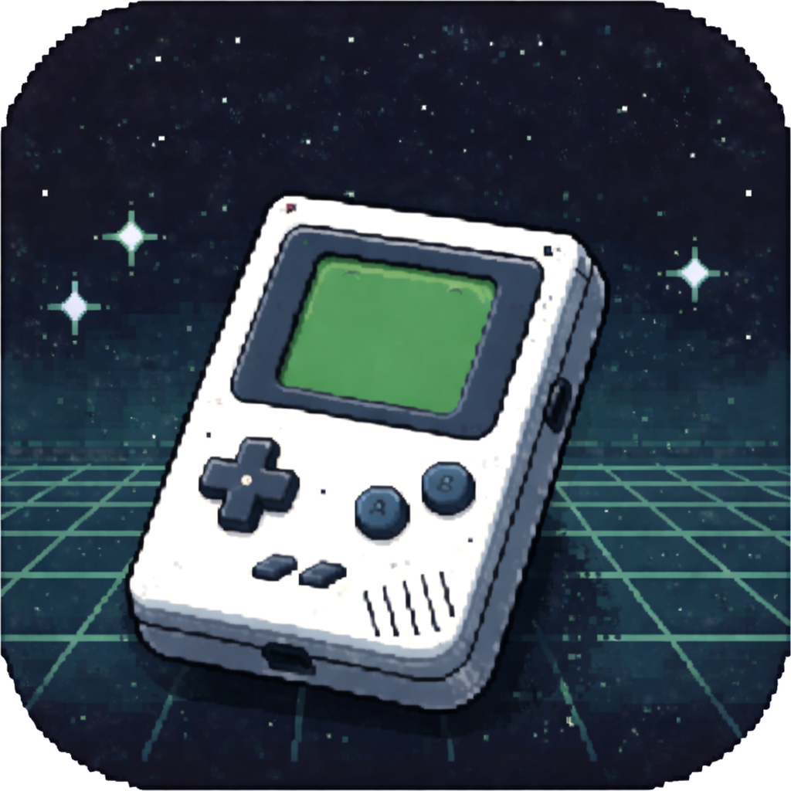
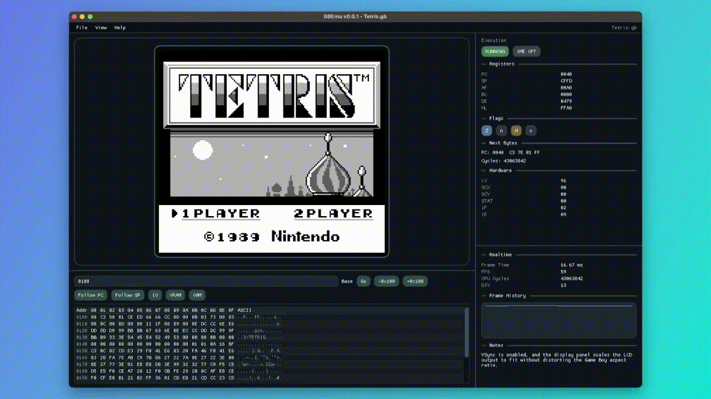
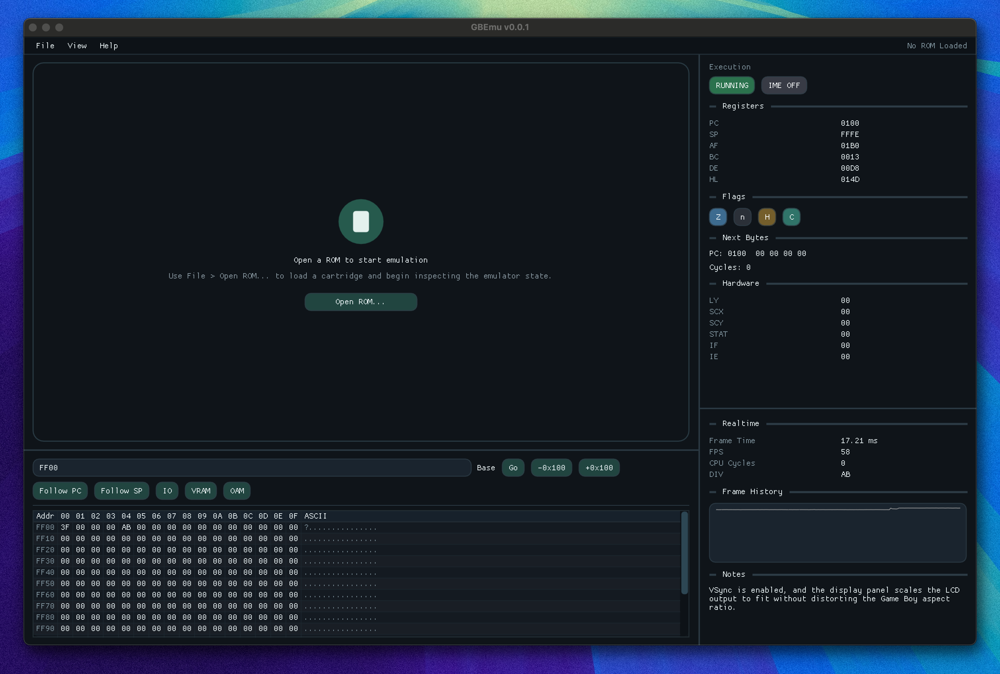
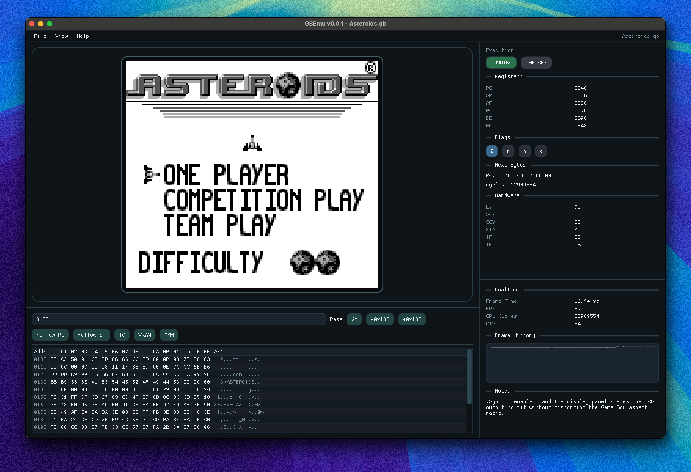

  

<h1 align="center">GBEmu</h1>

Game Boy emulator with a polished desktop UI and built-in CPU, memory, and performance debugging tools.

  

<table align="center">
  <tr>
    <td valign="top" width="50%">
      
    </td>
    <td valign="top" width="50%">
      
    </td>
  </tr>
</table>

## Overview

GBEmu combines real-time Game Boy emulation with a debugger-style desktop interface. Rather than treating the emulator as a black box, the app exposes CPU registers, memory contents, and frame timing alongside the running game screen. That makes it useful both as a playable desktop build and as a tool for understanding emulator behavior while a ROM is running.

## Features

- Real-time Game Boy emulation in a desktop debugging interface
- Integrated CPU, memory, and performance inspection while a ROM is running
- Clean, docked layout designed for analysis as well as play
- Fast ROM loading for testing and iteration
- Downloadable macOS pre-release builds

## Getting Started

1. Download the latest build from [GitHub Releases](https://github.com/ikhaliq15/gbemu/releases).
2. Open `GBEmu.app`.
3. Select `File > Open ROM...` and choose a `.gb` ROM.
4. Use the `View` menu to show or hide the CPU, Memory, and Performance panels.

The current interface is designed around a fixed, analysis-friendly layout: the game screen remains front and center, while the debug panels stay docked in place around it.

## Controls

- D-pad: Arrow keys
- A / B: `A` and `B`
- Start / Select: `Enter` and `Space`
- Open ROM: `Cmd+O`

## Release Status

`v0.0.1` is the first public pre-release of GBEmu. It marks the transition from a backend-focused emulator project to something that can be downloaded, launched, and explored as a desktop application.

## Notes

- GBEmu is still an early build. Compatibility, accuracy, and performance are all actively evolving, so some ROMs may behave incorrectly or fail to run as expected.
- The current release is primarily aimed at macOS users. The downloadable app bundle is the easiest way to try the project today.
- ROMs are not included with releases. You will need to provide your own `.gb` files.
- On macOS, the app may show an unidentified developer warning until the release process includes signing and notarization.
- The included debug panels are part of the intended experience in this release. GBEmu is not just presenting the game screen; it is also exposing emulator internals while the ROM is running.

## Development

Contributor setup, build commands, test commands, and release workflow details live in [DEVELOPMENT.md](DEVELOPMENT.md).
